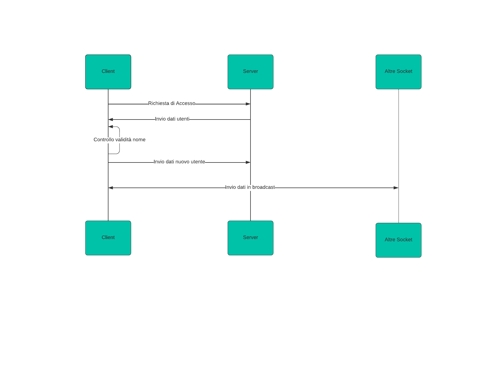
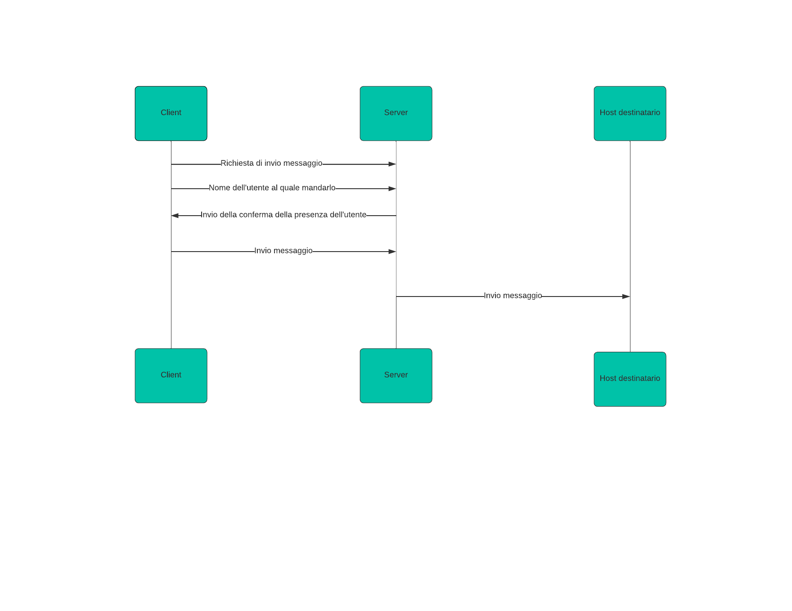
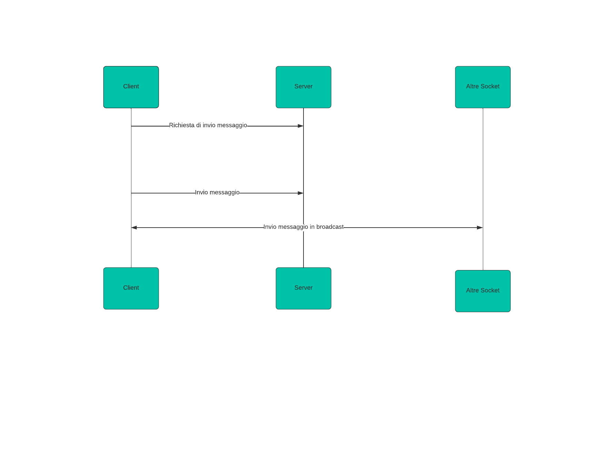
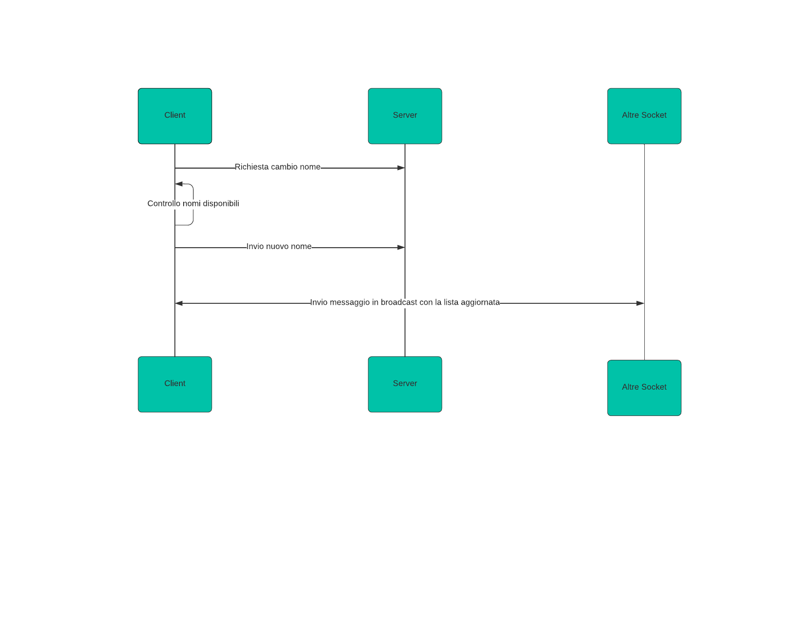
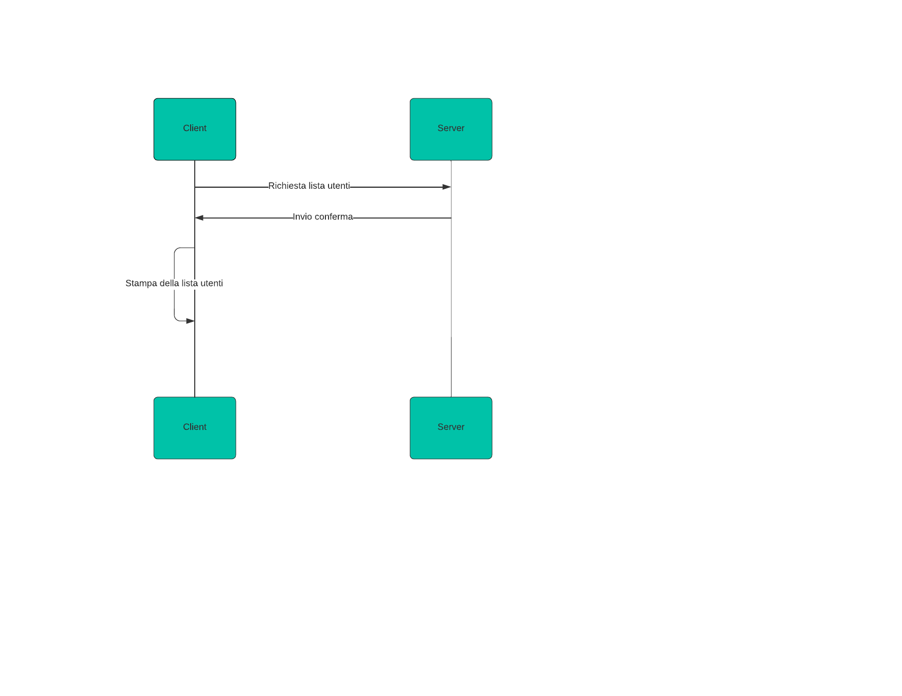
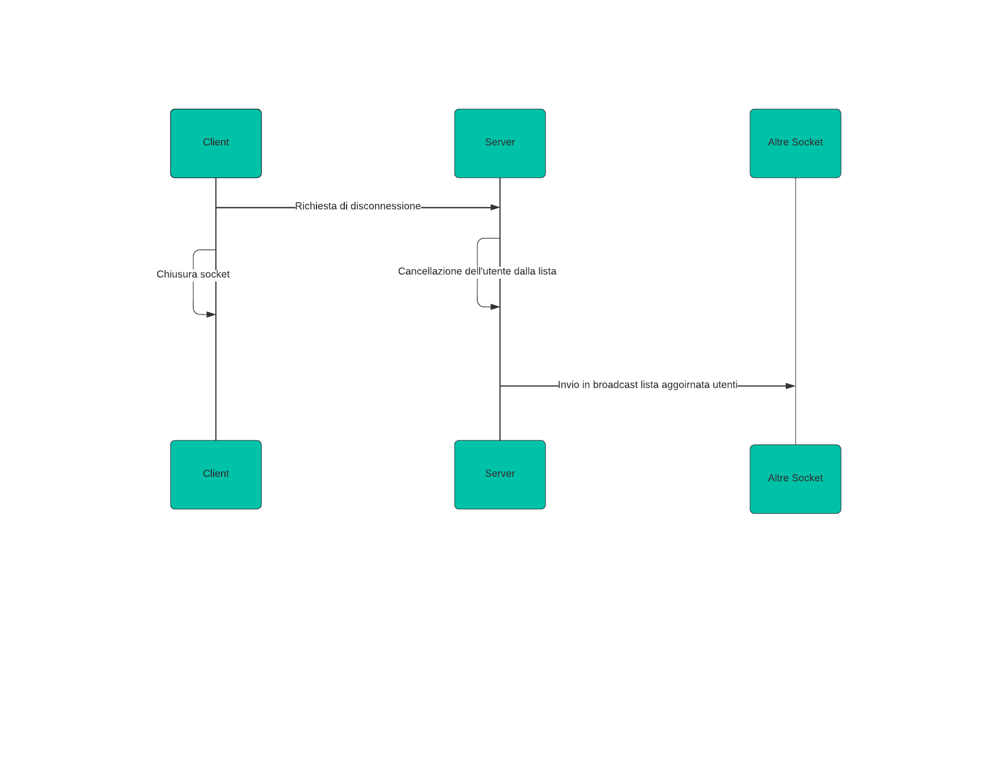

# Programma di messaggistica Client-Server
## Indice
1. [Descrizione](#descrizione)
2. [Strumenti Utilizzati](#strumenti)
3. [Comandi](#comandi)
4. [Team di Sviluppo](#team-di-sviluppo)
### Descrizione
***
Un programma di messaggistica con architettura client-server in Java, basato sul protocollo TCP e che permette una comunicazione full-duplex. 
Il client può inviare messaggi in brodcast o ai singoli client.
## Strumenti
***
Lista delle tecnologie utilizzate :
* Linguaggio di Programmazione : [Java](https://www.java.com/it/) ([Maven](https://maven.apache.org/))
* IDE : [Visual Studio Code](https://code.visualstudio.com/)
* Linguaggio di Markup : [Json](json.org/json-it.html)
## Comandi
***
Comandi disponibili : 

| Comando        | Descrizione                                                        |
| :---           |:---                                                                |
| /<nome_utente> | serve per l'invio dei messaggi in privato                          |
| /all           | serve per l'invio dei messaggi in braodcast                        |
| /list          | serve per stampare la lista di tutti gli utenti connessi al server |
| /rename        | serve per cambiare il proprio nome utente                          |
| /disconnect    | serve per disconnettersi dal server                                |

NOTA : 
* Gli utenti vengono serializzati come [Json](json.org/json-it.html).
* In caso avvenga una disconnessione forzata della client socket il server cancellerà l'utente dalla lista.
* In caso il server chiuda improvvisamente la connessione nessun utente verrà salvato nella lista.
## Team di Sviluppo
***
* [Matteo Ottria](https://github.com/MatteOttria)
* [Mattia Vestri](https://github.com/WestriMattia)
## Diagrammi UML
***
### Accesso

### Messaggio in privato

### Messaggio in broadcast

### Cambio del nome utente

### Lista utenti

### Disconnessione

